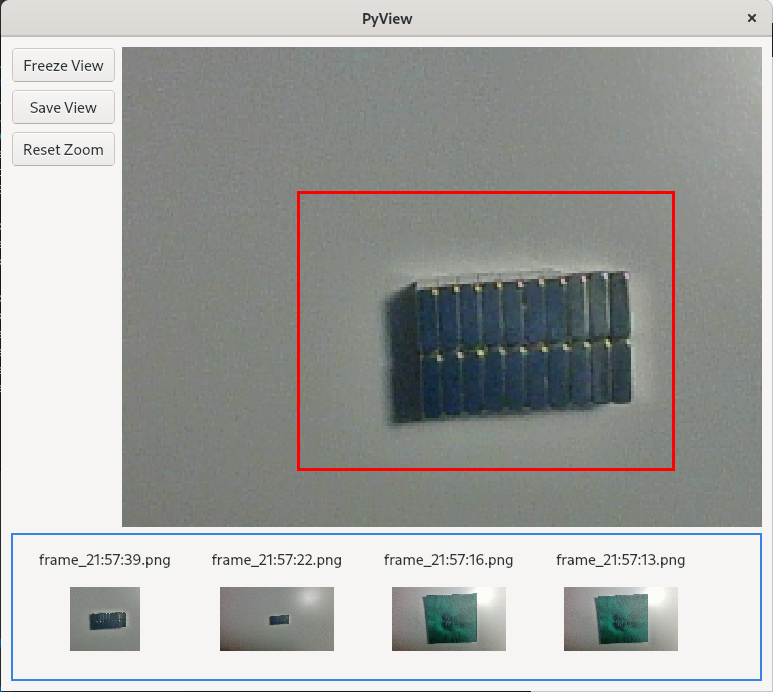
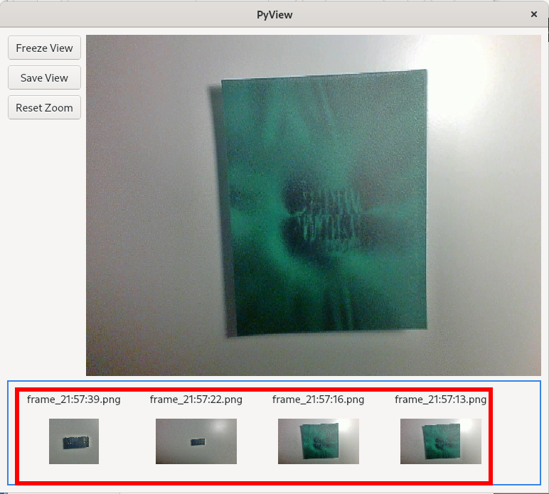

# PyView

PyView is simple app allowing to read video device, save frames, investigate previous frames. It is written in python and QT5. 

## HOW TO INSTALL

### Dependencies: 

Rquired packages for app:

#### Ubuntu:
```
sudo apt-get install python3
sudo apt-get install python3-pip
sudo apt-get pkg-config
sudo apt-get install libglib2.0-dev
sudo apt-get install libgirepository1.0-dev
sudo apt-get install libcairo2-dev

sudo apt-get install python3-pyqt5  
```

#### Fedora:
```
sudo yum install python3
sudo yum install python3-pip
sudo yum install glib2-devel
sudo yum install gobject-introspection-devel
sudo yum install cairo-devel

sudo yum install python3-pyqt5  
```

#### gstreamer

Check if gstreamer exists:

```
gst-launch-1.0 --gst-version
```
if not please follow:
https://gstreamer.freedesktop.org/documentation/installing/on-linux.html?gi-language=c 

to install gstreamer. 

### Installing python libraries


Clone repository
```
git clone https://github.com/PeterWaIIace/PlayingWithVideoFeed.git
```

Go to pyView directory:

```
cd pyView
```

To install required libraries run:

```
python3 -m pip install -r requirements.txt
```
You can also install libraries from rquirements.txt manually 
(in case when required version is not available on your OS).

### Run App

To run app go to pyView directory:

```
cd pyView
```

and execute following command:

```
python3 main.py
```

After that main window should be visible. 

#### Features

##### 1. Main VideoFeed

Window provide simply option to display camera view, and zoom into interesting elements


##### 2. Zoom

To zoom press on main videofeed area, after pressing button you can mark the interesting region ot zoom in.



Zoom can be done on livefeed or static images like previous frames.
##### 3. Freeze, Save, Reset

Buttons provide crucial features for videfeed manipulation. 

Freeze and Unfreeze - allows to stop and start videofeed.
Save - saves the current frame into static directory "saved_frames/"
Reset - resets zoom/zoom out.
 


##### 4. Previous frames

You can investigate previous frames, by pressing one of the images representing saved frames. It allows for example to zoom in and investigate static frames.



##### 5. Gstreamer configuration

App gives some capabilities to modify paramteres of Gstreamer pipe and change input device. 
By default app is looking for "/dev/video0" which commonly is built in webcam. 
To change the device and pipe parameters you can edit "pyView/src/config_gstream.yaml".


